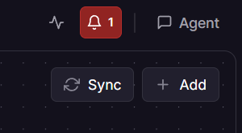
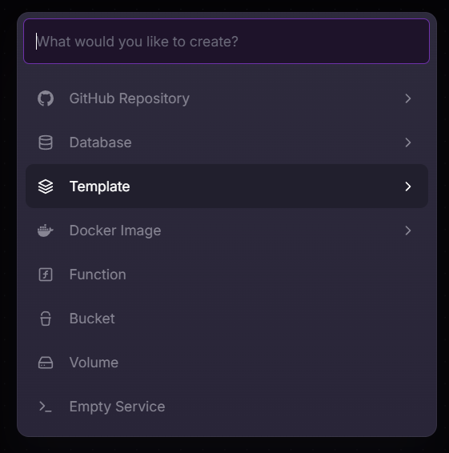
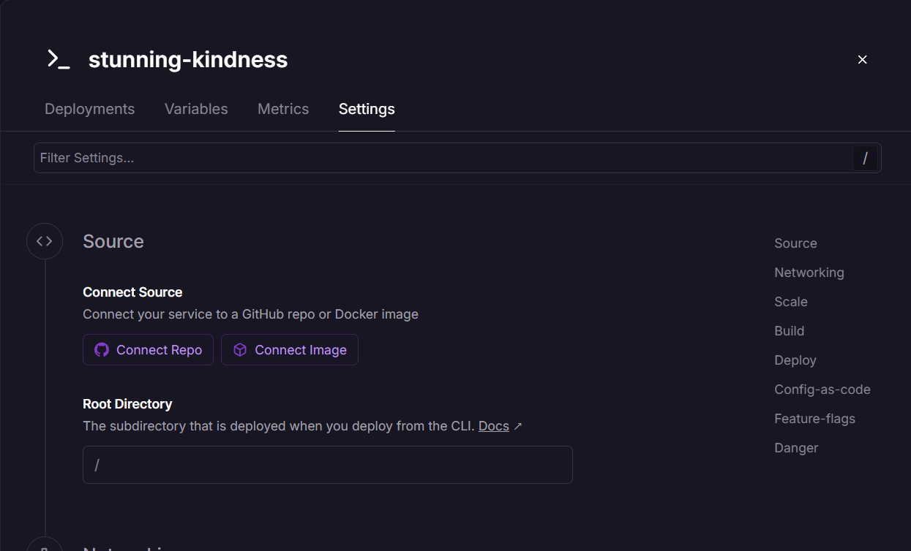
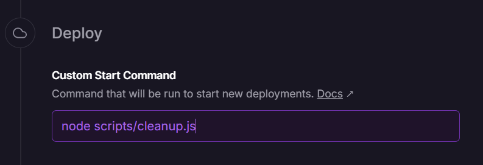
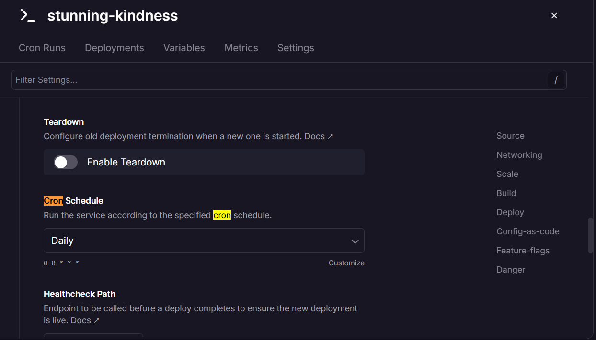
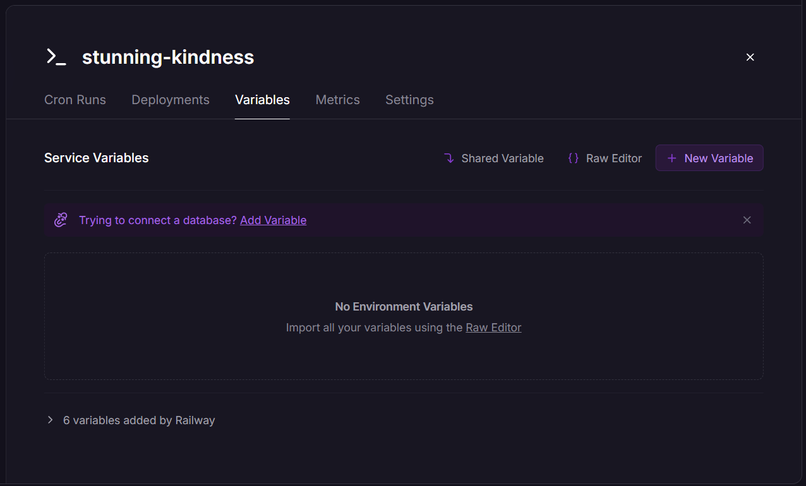
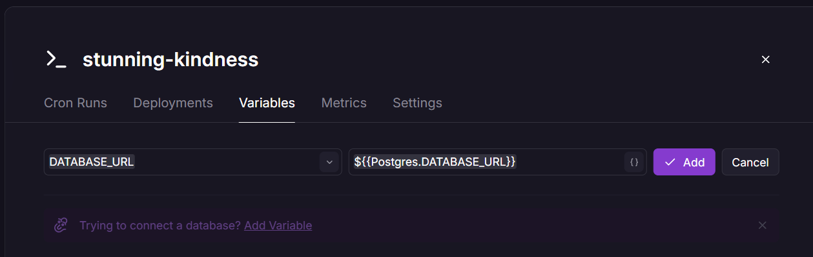

# Your Database Is Quietly Filling Up — And Your Auth System Is the Culprit

Every time a user logs out of your app, you store a record in the database. Every refresh token rotation creates another row. Every "logout from all devices" call writes more data. The tokens expire, but the rows don't disappear on their own.

This is one of those problems that doesn't hurt on day one. It hurts six months later when you're staring at a table with 200,000 rows and wondering why your queries are slowing down.

---

## The Context: A JWT Auth System Without Redis

The setup we're working with is a Node.js API hosted on Railway, using PostgreSQL as the sole data store — no Redis, no external cache. Auth is handled with short-lived access tokens and rotating refresh tokens.

After migrating away from Redis, three tables now carry the weight of token management:

```sql
-- Revoked access tokens (individual logouts)
token_blacklist (
  token_hash  TEXT PRIMARY KEY,
  user_id     INTEGER,
  expires_at  TIMESTAMPTZ
)

-- Tracks when a user triggered a global logout
user_global_logout (
  user_id       INTEGER PRIMARY KEY,
  logged_out_at TIMESTAMPTZ
)

-- Active and rotated refresh tokens
refresh_tokens (
  jti        TEXT PRIMARY KEY,
  user_id    INTEGER,
  expires_at TIMESTAMPTZ,
  revoked    BOOLEAN
)
```

These tables serve a real purpose while tokens are alive. The problem is what happens after they die.

---

## The Problem: Expired Rows That Never Leave

A JWT access token might live for 15 minutes. A refresh token for 7 days. Once `expires_at` passes, those rows are functionally useless — no valid token will ever match them again. But PostgreSQL doesn't know that. It keeps them around indefinitely.

Here's what accumulates over time:

- A user logs in and out once a day → 1 `token_blacklist` row per logout, 1–2 `refresh_tokens` rows per session
- 100 active users → thousands of rows per month
- All of them expired, none of them deleted

The `authUser` middleware queries `token_blacklist` and `refresh_tokens` on **every single authenticated request**. As those tables grow, so does the time spent scanning rows that will never match anything.

```sql
-- This runs on every request. What does it scan?
SELECT 1 FROM token_blacklist
WHERE token_hash = $1 AND expires_at > NOW();
```

With an index on `expires_at` the query stays fast for a while — but the index itself grows, and PostgreSQL's autovacuum still has to deal with dead tuples from previous deletes. The cleaner approach is to not accumulate them in the first place.

---

## The Solutions

There are a few ways to handle this, each with different tradeoffs.

**Option 1: Let the application clean up inline**

Delete expired rows as part of normal request handling — for example, after a successful logout. Simple, but unreliable. If traffic is low, cleanup doesn't happen. If traffic is high, you're adding write overhead to already-loaded paths.

**Option 2: PostgreSQL `pg_cron`**

If your Postgres instance has the `pg_cron` extension enabled, you can schedule cleanup directly in the database:

```sql
SELECT cron.schedule('cleanup-expired-tokens', '0 3 * * *', $$
  DELETE FROM token_blacklist WHERE expires_at < NOW();
  DELETE FROM refresh_tokens WHERE expires_at < NOW();
$$);
```

Clean, self-contained, no application code involved. The downside: Railway's managed PostgreSQL doesn't expose `pg_cron` by default, so this isn't always an option.

**Option 3: A dedicated cron service**

Run a small script on a schedule — separate from the main API process, triggered by the infrastructure. This is the approach we're going with.

---

## What We're Going With: A Railway Cron Service

Rather than patching cleanup into the API or relying on database extensions, we're creating a standalone cron service on Railway. It runs once a day, executes two DELETE statements, and exits.

The script is minimal:

```javascript
// api/scripts/cleanup.js
import { pool } from '../db/db.js';

const cleanup = async () => {
  try {
    const { rowCount: blacklistDeleted } = await pool.query(
      'DELETE FROM token_blacklist WHERE expires_at < NOW()'
    );
    const { rowCount: refreshDeleted } = await pool.query(
      'DELETE FROM refresh_tokens WHERE expires_at < NOW()'
    );

    console.log(`Cleanup complete: ${blacklistDeleted} blacklist rows, ${refreshDeleted} refresh token rows removed`);
  } catch (error) {
    console.error('Cleanup failed:', error);
    process.exit(1);
  } finally {
    await pool.end();
    process.exit(0);
  }
};

cleanup();
```

The Railway cron service points to the same repository, sets `api` as the root directory, uses `npm run cleanup` as the start command, and runs on schedule `0 3 * * *` — 3 AM UTC daily. It shares the same `DATABASE_URL` environment variable as the main API.

No new dependencies. No changes to the API itself. Just a scheduled process that does one thing and exits cleanly.

---

## Setting Up the Cron Service on Railway

With the script and npm command in place, the last piece is wiring it up on Railway. This takes about five minutes.

### 1. Create a new service

From your Railway project dashboard, click **New Service → Empty Service**. Give it a name that makes its purpose obvious — something like `token-cleanup` or `db-cron`.



> 📸 _[screenshot: New Service button on Railway dashboard]_

### 2. Connect the repository

Inside the new service, go to **Settings → Source** and click **Connect Repo**. Select the same repository your API lives in.


> 📸 _[screenshot: Connect Repo inside Source section]_

### 3. Set the root directory

Since the cleanup script lives inside the `api/` folder of the repo, set the **Root Directory** field to:

```
api
```

This tells Railway to treat `api/` as the working directory, so it picks up the correct `package.json` and can resolve the script path.

### 4. Set the start command

Scroll down to **Deploy → Custom Start Command** and click **+ Start Command**. Enter:

```
node scripts/cleanup.js
```

This is the command Railway will execute each time the cron fires. It maps directly to the `cleanup` script you added to `package.json`.


> 📸 _[screenshot: Start Command field with "npm run cleanup"]_

### 5. Configure the cron schedule

Still in **Settings**, scroll to **Deploy → Cron Schedule**. Switch the dropdown from the presets to **Custom** and enter:

```
0 3 * * *
```

This runs the job every day at 03:00 UTC. Railway will display the human-readable interpretation below the field — confirm it reads _"At 03:00"_ before moving on.


> 📸 _[screenshot: Cron Schedule field with "0 3 * * *" and "At 03:00 (UTC)" label]_

### 6. Add the environment variable

Go to the **Variables** tab of the cron service and add the same `DATABASE_URL` your API uses. Without this, the script has no way to reach the database.

```
DATABASE_URL=postgresql://...
```

You can copy it directly from your main API service's variables panel.



> 📸 _[screenshot: Variables tab with DATABASE_URL set]_

### 7. Deploy and verify

Save the settings and trigger a deploy. Railway will run the start command immediately for the first time. Go to the **Deployments** tab and open the most recent deployment log. You should see something like:

```
Cleanup complete: 12 blacklist rows, 8 refresh token rows removed
```

If the process exits with code `0`, the job ran successfully. Railway will schedule the next run automatically according to the cron expression.

> 📸 _[screenshot: Deployment log showing cleanup output]_

---

## A Note on Cron Expressions

If `0 3 * * *` is new to you, here's how to read it:

```
┌─ minute (0–59)
│ ┌─ hour (0–23)
│ │ ┌─ day of month (1–31)
│ │ │ ┌─ month (1–12)
│ │ │ │ ┌─ day of week (0–7, 0 and 7 = Sunday)
│ │ │ │ │
0 3 * * *
```

`0 3 * * *` means: at minute 0 of hour 3, every day, every month, every day of the week. [crontab.guru](https://crontab.guru) is a useful tool if you want to verify or adjust the schedule.

---

## That's It

The cron service runs independently from the API, doesn't affect request latency, and exits cleanly after each run. The tables stay lean, the queries stay fast, and there's nothing to maintain beyond the script itself.

If you're running a similar auth setup and haven't dealt with this yet — the SQL and script above are all you need to get started.