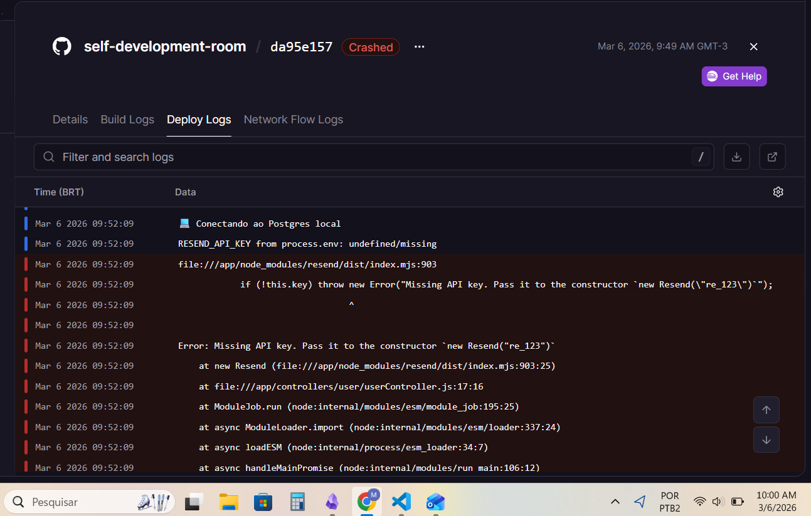
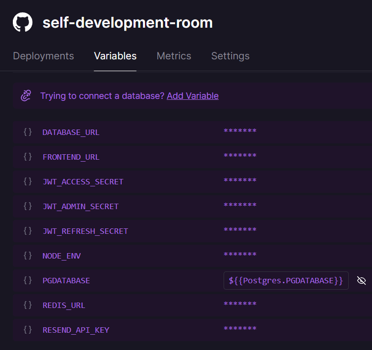
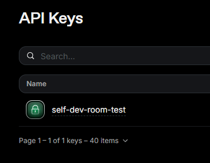
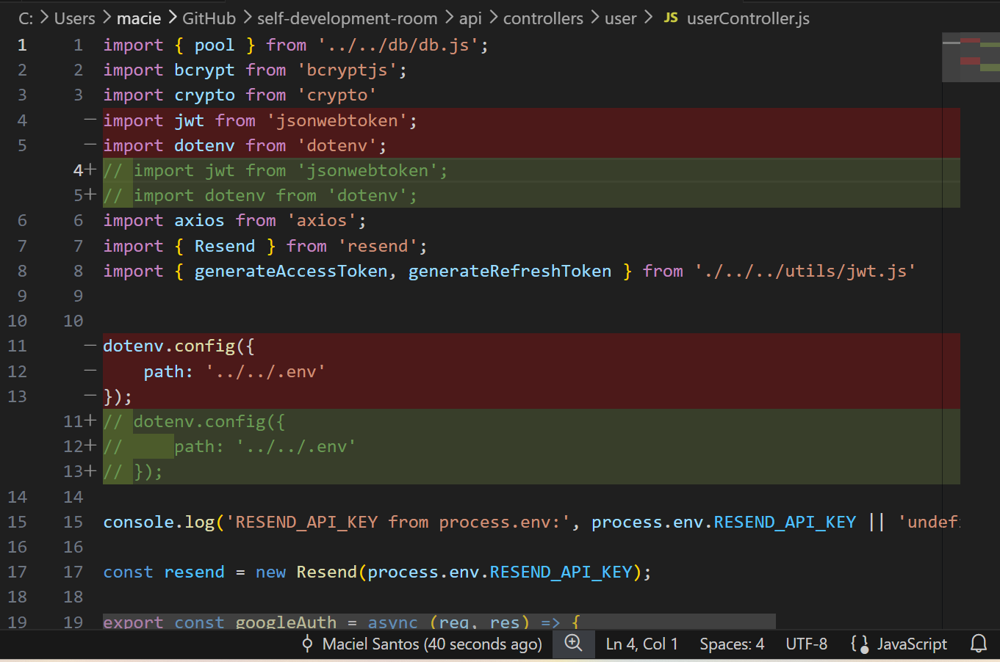
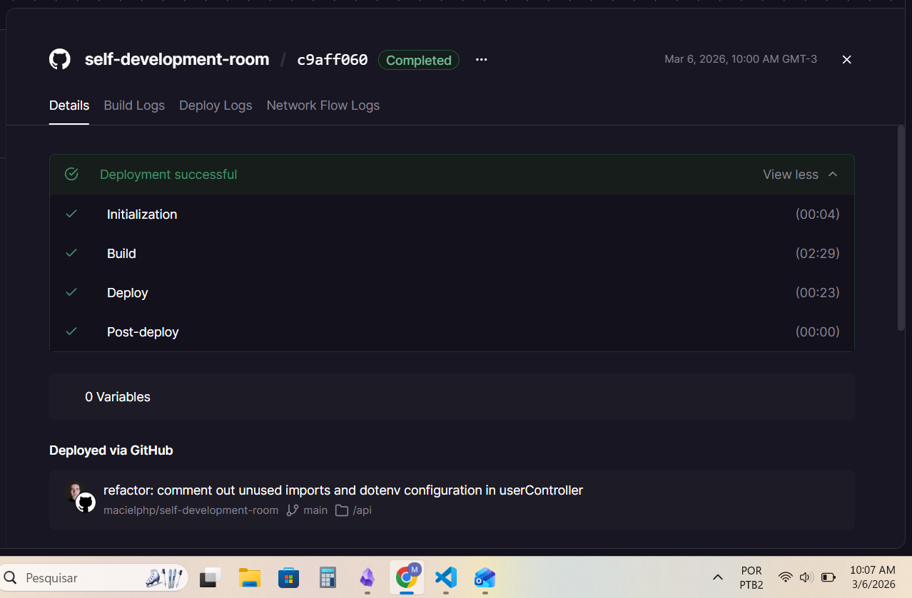

# Do not use dotenv in Railway

## The crash
I tried several times to deploy the project's API in Railway. But, I got errors saying that RESEND_API_KEY was undefined.



I asked Claude and Grok to help me solve the problem. They also told me I had to verify if the Railway Service API variable value was correct. 

- "Yes", I said. 



- Would it be wrong? 
- "No". 
- Why?
- Because the local API and Supabase DB worked before with the same code. 

I went to Resend to check the activity of the API key and it looked good. No errors.



Claude even helped me with some PORT hard code. 

## Questioning code
The first thing I questioned was whether the path configured in dotenv.config was correct.

```js
dotenv.config({
    path: '../../.env'
});
```

What if Railway ran the code and dotenv.config pointed to a different path than expected? 

Even though it worked locally, it might not work in Railway because of internal environment differences that I wasn't aware of.

So I commented out the dotenv.config, committed the change, pushed the code, and redeployed.



It worked.



## Lesson
When deploying on Railway, you usually should not manually load .env files with custom paths.

Railway already injects environment variables into process.env, so overriding or redirecting .env paths can break the configuration.

In my case, removing dotenv.config fixed the issue.

Check the repository for newer updates and improvements: https://github.com/macielphp/self-development-room

